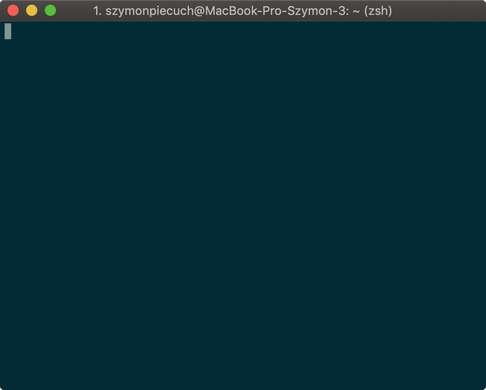

# :crown: Quinvoice - the Queen of invoices :rocket:

[](https://www.npmjs.com/package/quinvoice)
[](https://github.com/Qcumbeer/quinvoice)
[](https://www.npmjs.com/package/quinvoice)

> Quinvoice is an interactive CLI tool for generating **simple** PDF invoices. It uses clean bootstrap template, and has possibility to save common used companies and invoice templates.

## How to install?

```bash
npm install -g quinvoice
```

## How to use?

Just run the `quinvoice` command from terminal and enjoy the interactive creator. :wink:



Check out our demo invoice here: [Demo Invoice](https://github.com/Qcumbeer/quinvoice/blob/master/docs/Faktura%20VAT%201:11:2018.pdf)

## Modules

### :pencil: Invoice

As you guess - the main module. Responsible for generating PDF. If you have a template or company defined before, it will ask you to choose it during the creation process.

### :department_store: Company

It's stupid to type full company information every single invoice, isnt's it? That's why the company module is there! Manage your companies and use them during invoice creation! Don't worry, you can update them or remove whenever you want.

### :clipboard: Template

If you generate the same invoice every month, then it's proper module for you! Create new template, and use it to create new invoice in only 2 steps. Easy, huh?

## Licence

Copyright &copy; 2018 by Szymon Piecuch under ISC licence.
